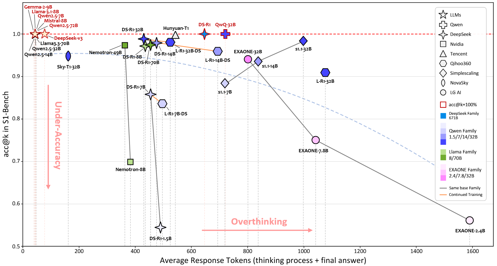
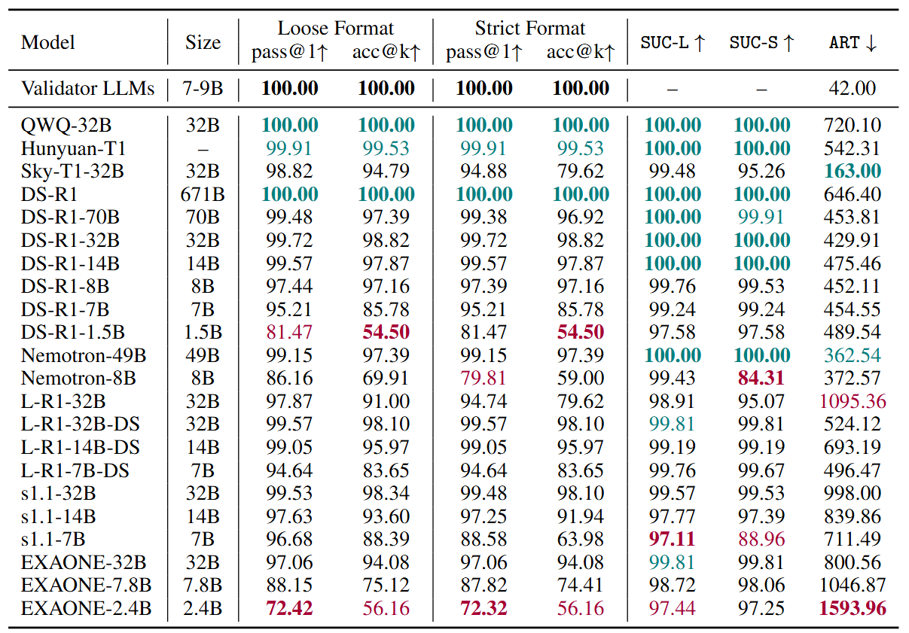
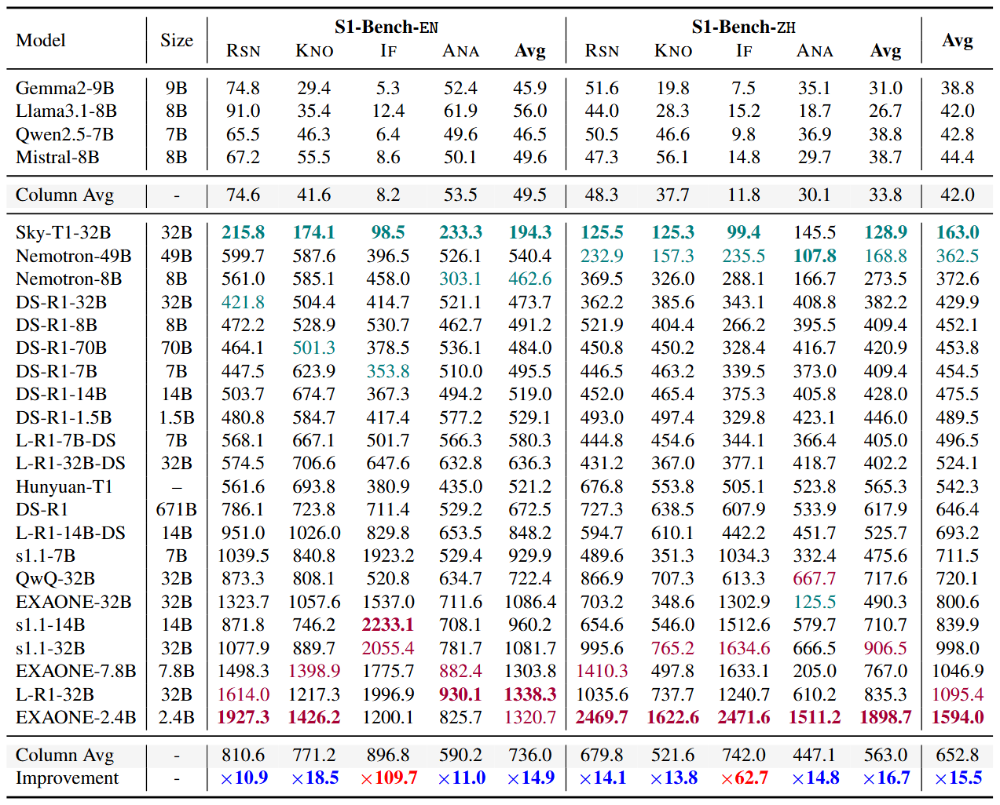

# S1-Bench: Exposing System 1 Thinking Barriers of Large Reasoning Models

 

## News
- [2025/04/13] 📢 We released S1-Bench dataset hosted on [Huggingface](https://huggingface.co/datasets/WYRipple/S1-Bench).
- [2025/04/13] We released our code source.

## How to use our project?
Before running our code, download the open-source LRMs.


| **Model ID** | **Abbreviation** | **URL** |
|---|---|---|
| DeepSeek-R1-Distill-Qwen-1.5B | DS-R1-1.5B | https://huggingface.co/deepseek-ai/DeepSeek-R1-Distill-Qwen-1.5B |
| DeepSeek-R1-Distill-Qwen-7B | DS-R1-7B | https://huggingface.co/deepseek-ai/DeepSeek-R1-Distill-Qwen-7B |
| DeepSeek-R1-Distill-Qwen-8B | DS-R1-8B | https://huggingface.co/deepseek-ai/DeepSeek-R1-Distill-Llama-8B |
| DeepSeek-R1-Distill-Qwen-14B | DS-R1-14B | https://huggingface.co/deepseek-ai/DeepSeek-R1-Distill-Qwen-14B |
| DeepSeek-R1-Distill-Qwen-32B | DS-R1-32B | https://huggingface.co/deepseek-ai/DeepSeek-R1-Distill-Qwen-32B |
| DeepSeek-R1-Distill-Qwen-70B | DS-R1-70B | https://huggingface.co/deepseek-ai/DeepSeek-R1-Distill-Llama-70B|
| DeepSeek-R1 | DS-R1 | https://huggingface.co/deepseek-ai/DeepSeek-R1 |
| Light-R1-7B-DS | L-R1-7B-DS | https://huggingface.co/qihoo360/Light-R1-7B-DS |
| Light-R1-14B-DS | L-R1-14B-DS | https://huggingface.co/qihoo360/Light-R1-14B-DS |
| Light-R1-32B-DS | L-R1-32B-DS | {https://huggingface.co/qihoo360/Light-R1-32B-DS |
| Light-R1-32B | L-R1-32B | https://huggingface.co/qihoo360/Light-R1-32B |
| s1.1-7B | s1.1-7B | https://huggingface.co/simplescaling/s1.1-7B |
| s1.1-14B | s1.1-14B | https://huggingface.co/simplescaling/s1.1-14B |
| s1.1-32B | s1.1-32B | https://huggingface.co/simplescaling/s1.1-32B |
| EXAONE-Deep-2.4B | EXAONE-2.4B | https://huggingface.co/LGAI-EXAONE/EXAONE-Deep-2.4B |
| EXAONE-Deep-7.8B | EXAONE-7.8B | https://huggingface.co/LGAI-EXAONE/EXAONE-Deep-7.8B |
| EXAONE-Deep-32B | EXAONE-32B | https://huggingface.co/LGAI-EXAONE/EXAONE-Deep-32B |
| Llama-3.1-Nemotron-Nano-8B-v1 | Nemotron-8B | https://huggingface.co/nvidia/Llama-3.1-Nemotron-Nano-8B-v1 |
| Llama-3.3-Nemotron-Super-49B-v1 | Nemotron-49B | https://huggingface.co/nvidia/Llama-3.3-Nemotron-Super-49B-v1 |
| Sky-T1-32B-Flash | Sky-T1-32B | https://huggingface.co/NovaSky-AI/Sky-T1-32B-Flash |

---

Fill in the path of the open-source model in the `local_model_list` of `get_LRM_vllm_response.py`.

Execute `get_LRM_vllm_response.py` and run all LRMs by switching `model_list[i]`.

```
python get_LRM_vllm_response.py
```

Next, run `split_think_answer.py` to obtain the several format types of the LRMs' responses.

```
python split_think_answer.py
```

Run the evaluation script `get_LRM_eval.py` to invoke GPT-4o for evaluating the final answers of the LRMs.

```
python get_LRM_eval.py
```

Finally, run `get_acc_scores.py` to obtain the evaluation results.

```
python get_acc_scores.py
```

## Experiment Results

 

 
